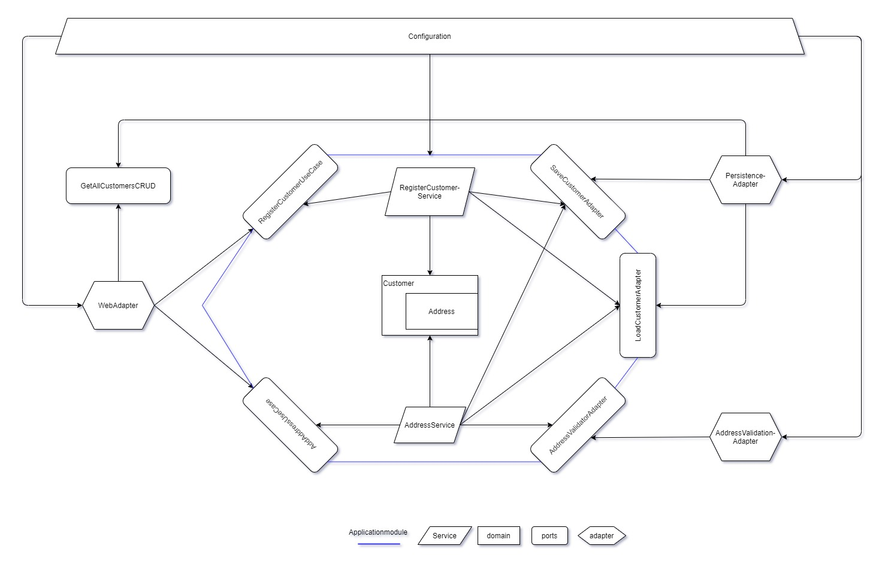

# hexagonal-example

Implementation of a hexagonal architecture in Spring Boot.

Most of the information on how to design in this way are from the following books:

[Get your hands dirty on clean architecture | Tom Hombergs](https://www.amazon.com/-/de/dp/B07YFS3DNF/ref=sr_1_1?__mk_de_DE=%C3%85M%C3%85%C5%BD%C3%95%C3%91&crid=2O6UP5K38LQV0&dchild=1&keywords=get+your+hands+dirty+on+clean+architecture&qid=1618151902&sprefix=get+your+hands+di%2Caps%2C225&sr=8-1)

[Clean Architecture: A Craftsman's Guide to Software Structure and Design | Robert C. Martin](https://www.amazon.com/-/de/dp/0134494164/ref=sr_1_1?__mk_de_DE=%C3%85M%C3%85%C5%BD%C3%95%C3%91&crid=263B083Z6653Y&dchild=1&keywords=clean+architecture&qid=1618151952&sprefix=clean+archi%2Caps%2C243&sr=8-1)

[Implementing Domain-Driven Design | Vernon Vaughn](https://www.amazon.com/-/de/dp/B00BCLEBN8/ref=sr_1_1?__mk_de_DE=%C3%85M%C3%85%C5%BD%C3%95%C3%91&crid=E6QQJD59WB0U&dchild=1&keywords=implementing+domain-driven+design&qid=1618152014&sprefix=implementing+d%2Caps%2C237&sr=8-1)

### How to run

To run this application you need to first run a

```cmd
mvn clean install
```

in the root directory of this project. This will download all required dependecies and bundle your project properly.

The database for this application is a mongo db. You either need to have one running on your system, or you can
alternatively start the MongoDB in docker with the included docker-compose file.

```cmd
docker-compose -f mongodb-docker-compose up
```

Docker / docker-compose need to be installed for this.

The application can then be started by running the main function in:

```
hexagonal-example\config\src\main\java\de\strasser\peter\hexagonal\HexagonalApplication.java
```

### What does this application do

This app can register customers, add addresses to these customers and retrieve a list of all customers.

The supported usecases in the business layer can be inspected in the applicationmodule. Under
application/src/main/java/de/strasser/peter/hexagonal/application/customer/port all the supported operations are clearly
visible, which is a major selling point to structure your application in this way.


### Application architecture



