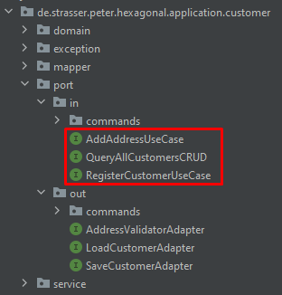
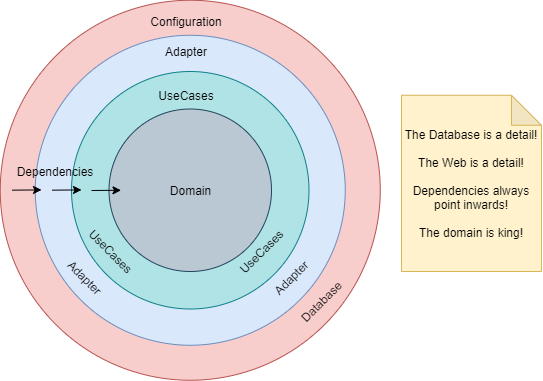
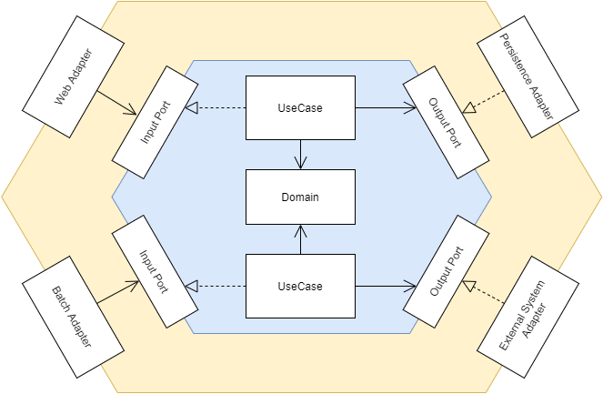
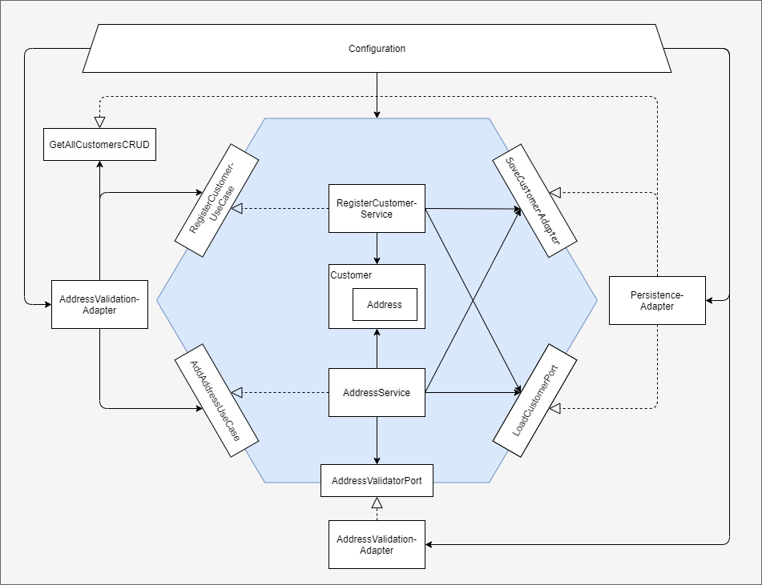
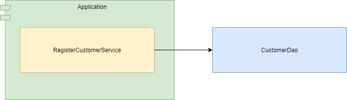
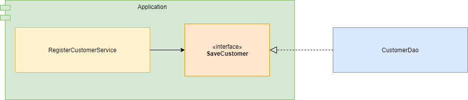

# hexagonal-example

Implementation of a hexagonal architecture in Spring Boot.

Most of the information on how to design in this way are from the following books:

[Get your hands dirty on clean architecture | Tom Hombergs](https://www.amazon.com/-/de/dp/B07YFS3DNF/ref=sr_1_1?__mk_de_DE=%C3%85M%C3%85%C5%BD%C3%95%C3%91&crid=2O6UP5K38LQV0&dchild=1&keywords=get+your+hands+dirty+on+clean+architecture&qid=1618151902&sprefix=get+your+hands+di%2Caps%2C225&sr=8-1)

[Clean Architecture: A Craftsman's Guide to Software Structure and Design | Robert C. Martin](https://www.amazon.com/-/de/dp/0134494164/ref=sr_1_1?__mk_de_DE=%C3%85M%C3%85%C5%BD%C3%95%C3%91&crid=263B083Z6653Y&dchild=1&keywords=clean+architecture&qid=1618151952&sprefix=clean+archi%2Caps%2C243&sr=8-1)

[Implementing Domain-Driven Design | Vernon Vaughn](https://www.amazon.com/-/de/dp/B00BCLEBN8/ref=sr_1_1?__mk_de_DE=%C3%85M%C3%85%C5%BD%C3%95%C3%91&crid=E6QQJD59WB0U&dchild=1&keywords=implementing+domain-driven+design&qid=1618152014&sprefix=implementing+d%2Caps%2C237&sr=8-1)

### Prerequisites

* Java 11
* Maven
* Docker or mongoDB

### How to run

To run this application you need to first run a

```cmd
mvn clean 
```

in the root directory of this project. This will download all required dependencies and bundle your
project properly. It will also auto generate some mapping classes with
the [mapstruct](https://mapstruct.org/) plugin.

The database for this application is a mongo db. You either need to have one running on your system,
or you can alternatively start the MongoDB in docker with the included docker-compose file.

```cmd
docker-compose -f mongodb-docker-compose up
```

The application can then be started by running the main function in:

```
hexagonal-example\config\src\main\java\de\strasser\peter\hexagonal\HexagonalApplication.java
```

### What does this application do

This app can register customers, add addresses to these customers and retrieve a list of all
customers.

The supported use cases in the business layer can be inspected in the application module. Under
application/src/main/java/de/strasser/peter/hexagonal/application/customer/port all the supported
operations are clearly visible, which is a major selling point to structure your application in this
way.



### Application architecture

This application tries to follow the design princples as described in Clean Architecture. To achieve
key characteristics of a good architecture (S.O.L.I.D., Flexibility, Testability, ... ), one very
defining lesson of Robert C. Martins book is that the business logic should be at the core of the
system.



This diagram shows where dependencies in a system should point to achieve this. How to implement
this however, feels very abstract.

Alistair Cockburn took this concept and
defined [hexagonal architecture](https://en.wikipedia.org/wiki/Hexagonal_architecture_(software)).
Alternatively this style is also known as the ports and adapters architecture. Perhaps more fitting,
but certainly not as exciting sounding as a hexagon.



In the middle lives the **Domain**. This is where all the business logik is contained. Ideally this
code is free of any framework specific annotations.

Ecapsulating these Domain models are the **Use Cases**. These represent the features that our
application provides. They receive commands and query / write the data to the adapters.

Between the Use Cases and the **Adapters** are the **Ports**. Especially the output ports are
important to control the direction of dependencies. In Java these represent interfaces. The output
adapters implement the output ports and therefore have to follow the contract, that the core of the
application defines for them. The input adapters only interact with the input ports and never with
the implementing serivces directly.

To achieve true decoupling between the application components the services are not allowed to
construct instances of objects themselves. If a use case class would construct the instance of an
output adapter in its class it would introduce dependencies into that layer, which we do not want.

For that we need an all controlling component, which instantiates all classes. This could be just a
main class in Java, where all the classes are constructed and dependencies are manually injected. In
a big enterprise application this task, would become confusing very fast. Typically, the role of
this all controlling component would be some form of DI-Framework, like Dagger, Guice, or in this
case Spring.

## Architecture as implemented in this project

### Overview

In the following diagram all dependencies, as they are implemented in the app are shown. The
configuration component is the component, where the Spring main function lives.



### Advantages of separated models on each layer

Some Examples:

- The customer response can easily exclude the (hashed) password without much effort. This separates
  the concern in what way to display the data to the client.


- The AddressType properties can be annotated with web specific annotations to control
  serialization, without cluttering the domain.


- The customer can be persisted different from the domain models structure. This way the concern on
  how to handle data persistence is independent of the business layer and can be handled by the
  persistence module.


- The Command models can validate the input to the business logic and make sure nothing
  unprocessable enters the services.

What we can learn from these examples is that, even though it might seem very redundant and tedious
work at first, every model has
a [specific job](https://en.wikipedia.org/wiki/Single-responsibility_principle) and is there for a
reason.

The overhead from writing more code in the beginning is offset by the fact that the code is much
more readable and maintainable.

### Advantages of the domain models in the center of the code

With the domain models being free of any framework specific annotations this is especially great for
unit testing your business logic. No spring context, that has to boot, no proxy classes, or any
services that need to be mocked.

Just plain old Java, which is easy to understand and fast to execute.

### Advantages of the adapters

One great benefit is that we comply with
the [Single Responsibility Principle](https://en.wikipedia.org/wiki/SOLID). Each adapter does only
the thing it is supposed to do. The web adapter for example only handles incoming web requests and
nothing else.

The clear separation of concerns also greatly increases flexibility. If you wanted to switch from an
SQL to NoSQL DB, you'd just have to rewrite your Persistence Adapter, but the rest of the
application should not be affected by your change.

### Advantages of the ports

The ports help us comply to
the [Interface Segregation Principle](https://en.wikipedia.org/wiki/Interface_segregation_principle)
and
the [Dependency Inversion Principle](https://en.wikipedia.org/wiki/Dependency_inversion_principle).

Between the adapters and the use case services the ports serve as a layer of abstraction. By
defining a port interface for every use case that we have, we can make sure that no client (or
adapter in this case) has to depend on methods that it does not use.

By defining the port interfaces we can force the adapters to comply to the rules of the application
/ business module. This is known as dependency inversion.



Without the interface the RegisterCustomerService / application module depends on the CustomerDao.



With the interface the CustomerDao depends on the Application module.

### Disadvantages of this architecture

This style of implementing a service has alot of overhead. For a simple CRUD application or any
application without much business logic this approach, would certainly be overkill and would result
in alot of tedious mapping without much benefit.

### So when should I use this architecture?

This architecture really shines in an environment with a lot of business logic and is *very* well
suited to implement [Domain Driven Design](https://de.wikipedia.org/wiki/Domain-driven_Design).
